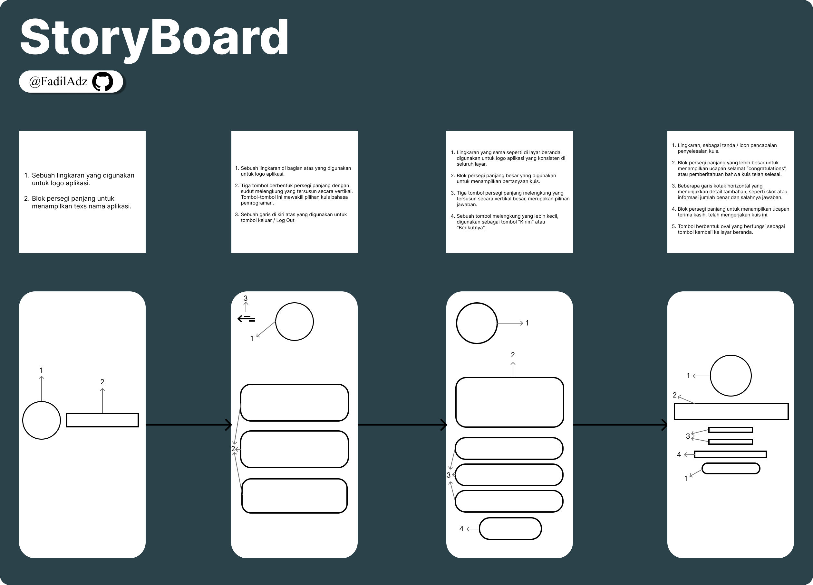
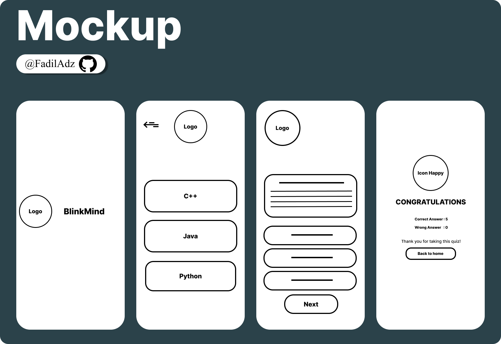
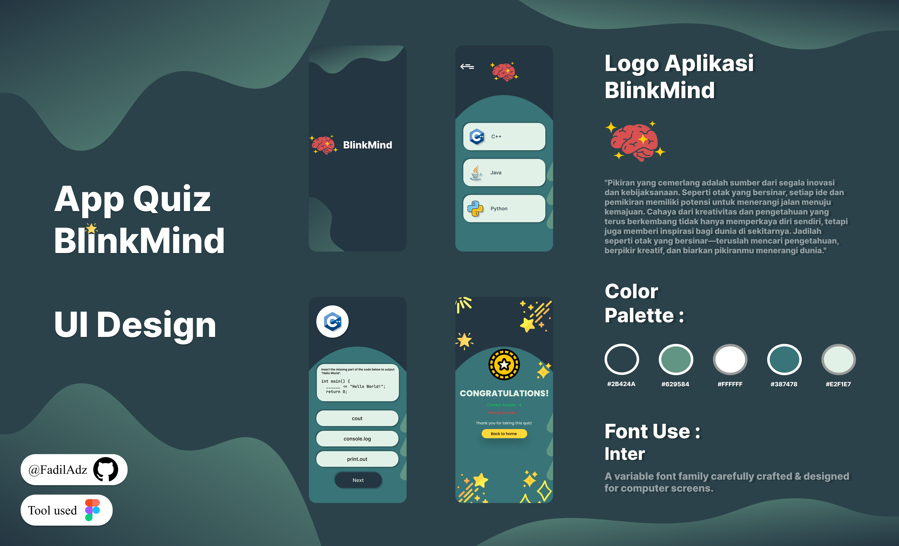
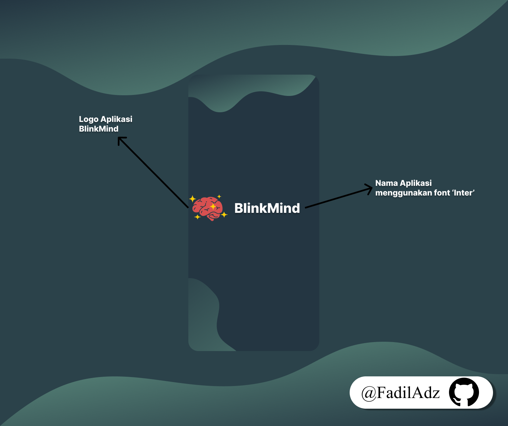
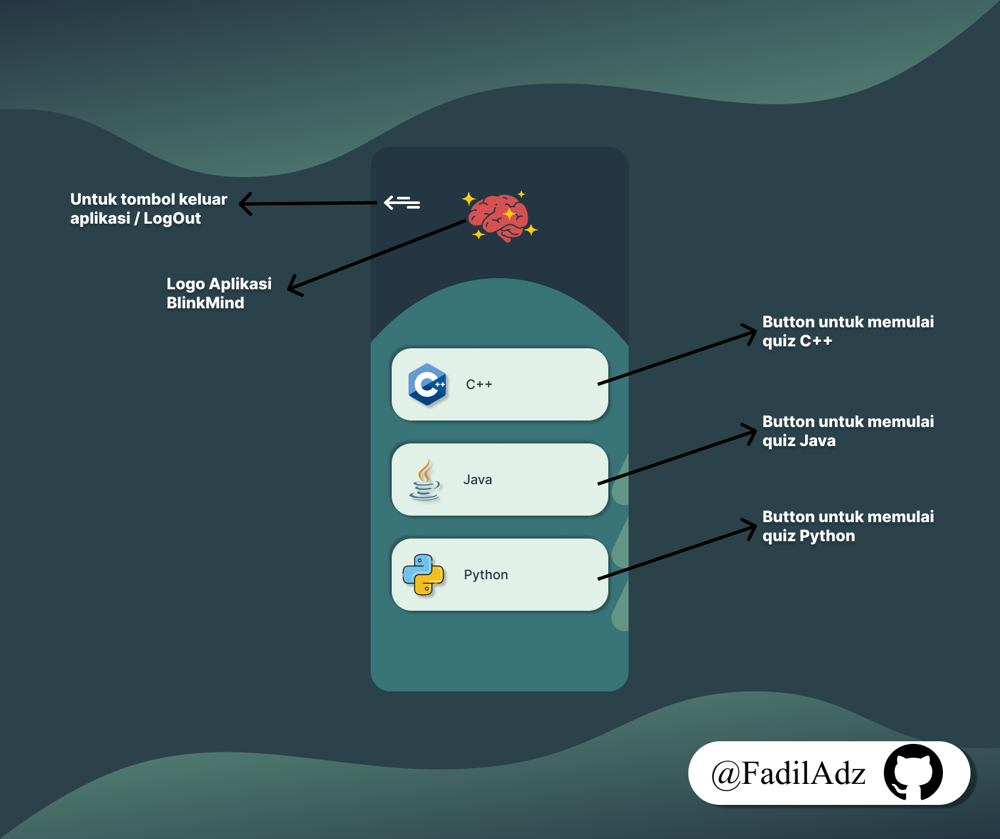
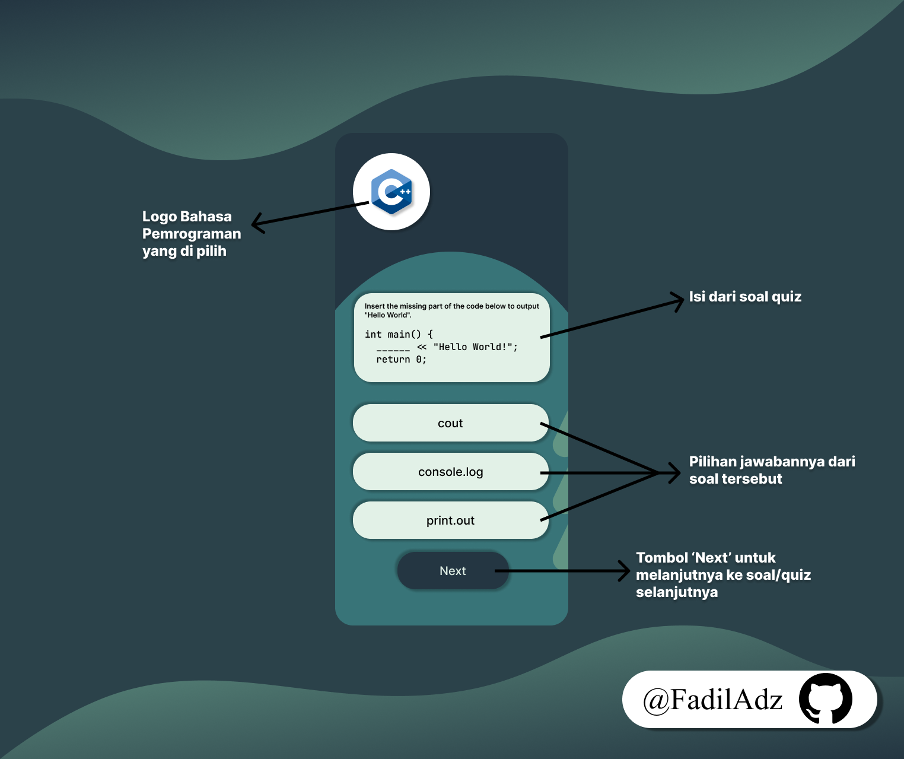
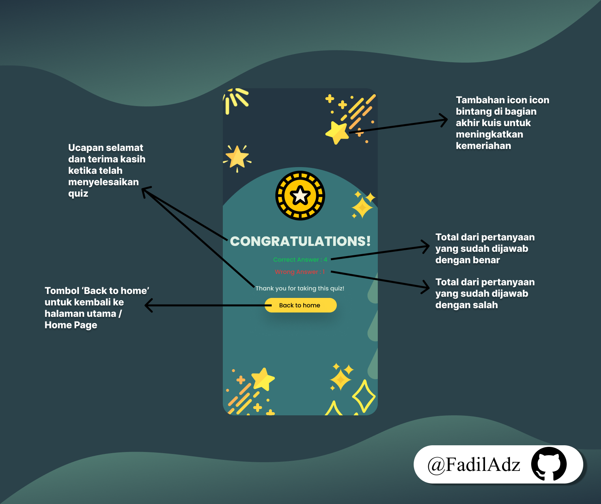

# BlinkMind
BlinkMind adalah sebuah aplikasi kuis interaktif yang bertemakan bahasa pemrograman seperti C++, Java, dan Python. Aplikasi ini dirancang untuk menguji pengetahuan coding Anda melalui berbagai pertanyaan menantang, dan meningkatkan pemahaman Anda tentang syntax coding dalam dunia pemrograman.

 

| Variable           |             Isi            |
| -------------------|----------------------------|
| **Nama**           |         Fadil Aditya Adzima    |
| **NIM**            |          312310617         |
| **Kelas**          |          TI.23.A.6         |
| **Mata Kuliah**    |      Pemrograman Web 1     |
| **Dosen Pengampu** | Eko Budiarto s.kom, m.kom  |

    

# $${\color{lightblue}StoryBoard}$$
 

    

     

# $${\color{lightblue}Mockup}$$
 

    

     

# $${\color{lightblue}UI-Design}$$
 

    

     

# $${\color{lightblue}SplashScreen}$$
 

    

     

# $${\color{lightblue}HomePage}$$
 

    

     

# $${\color{lightblue}QuizPage}$$
 

    

     

# $${\color{lightblue}EndPage}$$
 

    

     
